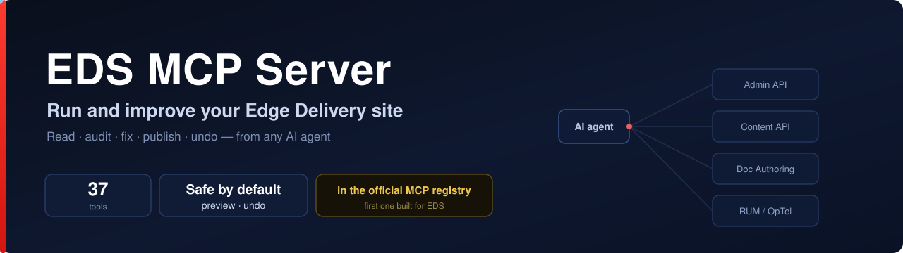
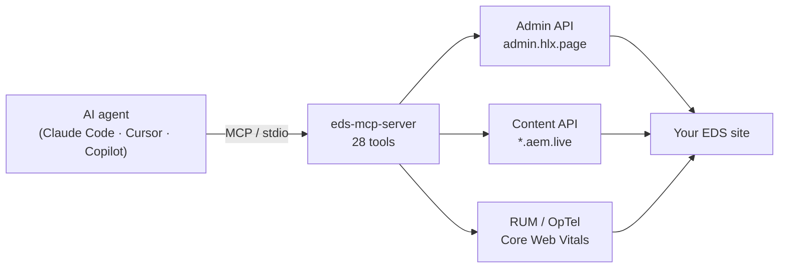
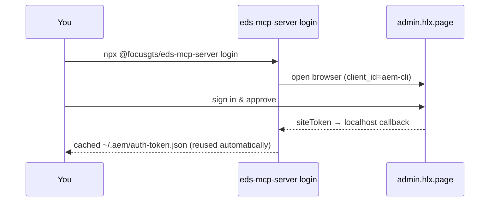

<div align="center">



[](https://www.npmjs.com/package/@focusgts/eds-mcp-server)
[](https://www.npmjs.com/package/@focusgts/eds-mcp-server)
[](https://registry.modelcontextprotocol.io)
[](https://github.com/punkpeye/awesome-mcp-servers)
[](LICENSE)

### Let an AI agent run your Adobe Edge Delivery site.

**28 tools. No extra dependencies beyond the MCP SDK. Works with any EDS site.**
The first MCP server purpose-built for Edge Delivery Services.


</div>

---

## ⚡ Do it in three lines

```bash
claude mcp add eds -e EDS_OWNER=your-org -e EDS_REPO=your-site -- npx @focusgts/eds-mcp-server
```

Then just ask your agent:

> *"Preview and publish the homepage."*
> *"What are the Core Web Vitals across the site?"*
> *"Find every page about pricing and list the ones missing a description."*

That's it — no local AEM, no scripts, no glue code.

---

## 🧠 How it works



The agent calls tools; the server talks to the live EDS infrastructure. Read-only tools (content, sitemap, metadata) need no credentials at all.

---

## 🔑 One-click sign-in

No more pasting a fresh admin token every day:



> Use Chrome or Firefox — Safari blocks the local callback (same as Adobe's AEM CLI). `EDS_API_KEY` works as the CI / fallback path.

---

## 🛠️ The 28 tools

<table>
<tr><td valign="top" width="33%">

**Publishing**
- `eds_preview_page`
- `eds_publish_page`
- `eds_unpublish_page`
- `eds_preview_and_publish`
- `eds_get_status`
- `eds_purge_cache`
- `eds_bulk_preview`
- `eds_bulk_publish`
- `eds_get_job_status`

</td><td valign="top" width="33%">

**Content**
- `eds_get_page`
- `eds_list_pages`
- `eds_search_pages`
- `eds_get_metadata`
- `eds_get_sitemap`
- `eds_get_redirects`

</td><td valign="top" width="33%">

**Analytics & config**
- `eds_get_cwv`
- `eds_get_404s`
- `eds_get_experiments`
- `eds_get_config`
- `eds_get_logs`
- `eds_get_api_keys`

</td></tr>
</table>

**Document Authoring (DA)** — direct access to the authored source, not the rendered output (requires `EDS_DA_TOKEN`):
`eds_da_list_sources` · `eds_da_get_source` · `eds_da_put_source` · `eds_da_delete_source` · `eds_da_copy_source` · `eds_da_move_source` · `eds_da_get_versions`

---

## 🔌 Add it to your tool

<details open>
<summary><b>Claude Code</b> — one command</summary>

```bash
claude mcp add eds -e EDS_OWNER=your-org -e EDS_REPO=your-site -- npx @focusgts/eds-mcp-server
```
</details>

<details>
<summary><b>Cursor</b> — <code>.cursor/mcp.json</code></summary>

```json
{
  "mcpServers": {
    "eds": {
      "command": "npx",
      "args": ["@focusgts/eds-mcp-server"],
      "env": { "EDS_OWNER": "your-org", "EDS_REPO": "your-site" }
    }
  }
}
```
</details>

<details>
<summary><b>VS Code (GitHub Copilot)</b> — <code>.vscode/mcp.json</code></summary>

```json
{
  "servers": {
    "eds": {
      "command": "npx",
      "args": ["@focusgts/eds-mcp-server"],
      "env": { "EDS_OWNER": "your-org", "EDS_REPO": "your-site" }
    }
  }
}
```
</details>

---

## ⚙️ Configuration

| Variable | Required | Description |
|----------|----------|-------------|
| `EDS_OWNER` | Yes | GitHub org/user that owns the EDS site repo |
| `EDS_REPO` | Yes | GitHub repository name |
| `EDS_REF` | No | Git branch (default: `main`) |
| `EDS_API_KEY` | No | Admin token (see Authentication). Browser login is the alternative. |
| `EDS_DOMAIN_KEY` | No | OpTel domain key for analytics queries (CWV, 404s, experiments) |
| `EDS_DA_TOKEN` | No | Document Authoring API token — enables the `eds_da_*` source tools |
| `EDS_DA_ORG` | No | DA org (defaults to `EDS_OWNER`) |
| `EDS_DA_REPO` | No | DA repo/site (defaults to `EDS_REPO`) |

**Read-only tools** (content, sitemap, metadata) need no keys. **Write tools** (preview, publish, cache) need an admin token. **Analytics tools** need `EDS_DOMAIN_KEY`. **DA source tools** need `EDS_DA_TOKEN`.

---

## 🔐 Authentication

Admin operations require an EDS Admin token. Two ways to provide one.

**Browser sign-in (recommended for interactive use)**

```bash
EDS_OWNER=your-org EDS_REPO=your-site npx @focusgts/eds-mcp-server login
```

Opens your browser to Adobe's `admin.hlx.page` login (the same flow as the AEM CLI). The admin site token caches at `~/.aem/auth-token.json` (mode `0600`, ~24h) and is reused automatically. **Use Chrome or Firefox — Safari blocks the local callback.**

**`EDS_API_KEY` (CI / automation, and the fallback)** — always takes precedence when set.

```bash
EDS_OWNER=your-org EDS_REPO=your-site EDS_API_KEY=<your-admin-token> npx @focusgts/eds-mcp-server
```

To get a token (per [Adobe's API key docs](https://www.aem.live/docs/admin-apikeys)): sign in at `https://admin.hlx.page/login`, then copy the `auth_token` cookie value from DevTools — or copy the `x-auth-token` header from an authenticated AEM Sidekick request. For a durable credential, configure a site API key.

---

## 🏗️ Architecture

Built following Adobe's MCP conventions (derived from `adobe-rnd/da-mcp`):

- TypeScript + `@modelcontextprotocol/sdk` + `zod`, stateless per request
- Tool naming: `eds_{verb}_{noun}` · stdio transport
- Native `fetch()` (Node 18+) — no HTTP dependencies

```bash
git clone https://github.com/Focus-GTS/eds-mcp-server.git
cd eds-mcp-server && npm install && npm run build && npm test
```

---

## 🧩 Part of the FocusGTS EDS suite

| | |
|---|---|
| [eds-content-ops-skills](https://github.com/Focus-GTS/eds-content-ops-skills) | AI skills for EDS content ops — first third-party contributor merged into [Adobe's official skills repo](https://github.com/adobe/skills) |
| [eds-ops](https://github.com/Focus-GTS/eds-ops) | CLI + GitHub Action for automated site grading and PR gating |
| [EDS Score](https://www.focusgts.com/eds-score/) | Free browser-based site health analyzer |

---

<div align="center">

Built by **[FocusGTS](https://focusgts.com)** — Adobe Silver Solution Partner · Apache-2.0
<br/>Not affiliated with or endorsed by Adobe Inc.

</div>
